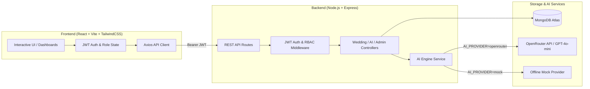

# 💍 WeddingAI — AI-Driven Wedding Album & Video Planning System

**WeddingAI** is a modern, production-ready MERN application designed to transform wedding briefs and multi-day ceremony schedules into actionable, cinematic video plans, highlight-film narrative structures, and heirloom album design concepts.

Powered by an AI engine (via OpenRouter with fallback to offline mock mode) and MongoDB Atlas, it provides role-specific workspaces for **Clients** and **Administrators**.

---

## 🌟 Key Features

### 💍 Client Workspace
- **Multi-Step Wedding Intake Wizard**: Step-by-step onboarding capturing couple names, venue, city, budget, guest count, aesthetic style, color palette, and multi-day ceremonies (Mehendi, Sangeet, Haldi, Ceremony, Reception).
- **AI-Powered Plan Generation**: Translates celebration briefs into:
  - **Function Video Plans**: Shot lists, lens & movement recommendations, music cues, color grading palettes, and editing directions for each ceremony.
  - **Cinematic Highlight Film**: Total runtime, narrative arc, beat-by-beat timeline, emotional peaks, and score suggestions.
  - **Heirloom Album Design**: Cover design suggestions, color harmonies, typography pairings, and multi-page layout spreads.
- **Interactive Production Boards**: View, review, and trigger re-generation of video plans and album designs.

### 🏛️ Admin Command Center
- **Studio Dashboard**: Real-time stats on total weddings, active projects, AI plans generated, pending reviews, and completed celebrations.
- **Workflow & Lifecycle Management**: Progress wedding milestones across statuses:
  `planning` ➔ `ai_generated` ➔ `under_review` ➔ `approved` ➔ `in_production` ➔ `completed`
- **Global Overview**: Inspect client briefs, schedules, and generated AI plans across all weddings.

---

## 🏗️ Architecture



---

## 🚀 Deployment 

- Deployed Backend on Render


- Deployed Frontend on Vercel

---

## 🛠️ Local Development

### 1. Prerequisites
- **Node.js** (v18+)
- **MongoDB** (local instance or MongoDB Atlas cluster)

### 2. Backend Setup
```bash
cd backend
cp .env.example .env
# Fill in MONGODB_URI, JWT_SECRET, and OPENROUTER_API_KEY
npm install
npm run seed     # Populates demo accounts and sample royal palace wedding
npm run dev      # Starts API server on http://localhost:5000
```

### 3. Frontend Setup
```bash
cd frontend
npm install
npm run dev      # Starts Vite dev server on http://localhost:5173
```

Visit **[http://localhost:5173](http://localhost:5173)** in your browser.

---

## 🔑 Demo Credentials

All pre-seeded demo accounts use the password: **`WeddingAI123!`**

| Role | Email | Description |
|---|---|---|
| **Client** | `client@weddingai.com` | Create celebrations, manage ceremonies, generate & view AI plans |
| **Admin** | `admin@weddingai.com` | Studio command center, monitor all client weddings, approve & update statuses |

---


## 📁 Project Structure

```text
├── backend/
│   ├── config/             # Database connection setup
│   ├── controllers/        # Express request handlers (auth, weddings, ai, admin)
│   ├── middleware/         # Auth, validation, error handler, rate limiters
│   ├── models/             # Mongoose schemas (User, Wedding, Function, VideoPlan, etc.)
│   ├── routes/             # Express API route declarations
│   ├── services/           # AI service layer (OpenRouter integration & mock generator)
│   ├── utils/              # Seed scripts, helpers, custom error classes
│   └── server.js           # Server entrypoint
├── frontend/
│   ├── src/
│   │   ├── components/     # UI kit, modals, status tags, protected routes
│   │   ├── context/        # Auth & Toast notification providers
│   │   ├── layouts/        # Responsive AppLayout with mobile drawer & sidebar
│   │   ├── pages/          # Client Dashboard, Admin Dashboard, Wedding Wizard, Detail, AI Plans
│   │   ├── services/       # Axios API client with interceptors
│   │   ├── App.jsx         # Routing & global Error Boundary
│   │   └── main.jsx        # App mounting
│   ├── index.html          # HTML entry
│   ├── vite.config.js      # Vite build configuration
│   ├── vercel.json         # Vercel SPA routing rewrites
│   └── tailwind.config.js  # Tailwind design system configuration
├── render.yaml             # Render Blueprint configuration
├── vercel.json             # Root Vercel fallback configuration
└── README.md
```
