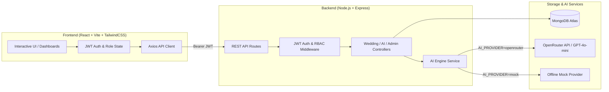

# 💍 WeddingAI — AI-Driven Wedding Album & Video Planning System

**WeddingAI** is a modern, production-ready MERN application designed to transform wedding briefs and multi-day ceremony schedules into actionable, cinematic video plans, highlight-film narrative structures, and heirloom album design concepts.

Powered by an AI engine (via OpenRouter with fallback to offline mock mode) and MongoDB Atlas, it provides role-specific workspaces for **Clients** and **Administrators**.

---

## 🌟 Key Features

### 💍 Client Workspace
- **Multi-Step Wedding Intake Wizard**: Step-by-step onboarding capturing couple names, venue, city, budget, guest count, aesthetic style, color palette, and multi-day ceremonies (Mehendi, Sangeet, Haldi, Ceremony, Reception).
- **AI-Powered Plan Generation**: Translates celebration briefs into:
  - **Function Video Plans**: Shot lists, lens & movement recommendations, music cues, color grading palettes, and editing directions for each ceremony.
  - **Cinematic Highlight Film**: Total runtime, narrative arc, beat-by-beat timeline, emotional peaks, and score suggestions.
  - **Heirloom Album Design**: Cover design suggestions, color harmonies, typography pairings, and multi-page layout spreads.
- **Interactive Production Boards**: View, review, and trigger re-generation of video plans and album designs.

### 🏛️ Admin Command Center
- **Studio Dashboard**: Real-time stats on total weddings, active projects, AI plans generated, pending reviews, and completed celebrations.
- **Workflow & Lifecycle Management**: Progress wedding milestones across statuses:
  `planning` ➔ `ai_generated` ➔ `under_review` ➔ `approved` ➔ `in_production` ➔ `completed`
- **Global Overview**: Inspect client briefs, schedules, and generated AI plans across all weddings.

---

## 🏗️ Architecture



---

## 🚀 Deployment Guide

### 1️⃣ Deploy Backend on Render

1. Log in to **[dashboard.render.com](https://dashboard.render.com/)**.
2. Click **New +** ➔ **Web Service**.
3. Select your repository: `AI-Driven-Wedding-Album-Video-Planning-System`.
4. Configure the settings:
   - **Name**: `weddingai-api` *(or your preferred name)*
   - **Root Directory**: `backend`
   - **Environment**: `Node`
   - **Branch**: `main`
   - **Build Command**: `npm install`
   - **Start Command**: `node server.js`
   - **Plan**: `Free`
5. Under **Environment Variables**, add:

   | Key | Value / Example | Notes |
   |---|---|---|
   | `NODE_ENV` | `production` | Production mode |
   | `PORT` | `5000` | Render sets this automatically |
   | `MONGODB_URI` | `mongodb://...` or `mongodb+srv://...` | Your MongoDB Atlas connection string |
   | `JWT_SECRET` | `generate_a_long_random_string` | Random 32+ character string |
   | `AI_PROVIDER` | `openrouter` | Set to `mock` if running without LLM key |
   | `OPENROUTER_API_KEY` | `sk-or-v1-...` | Your OpenRouter API key |
   | `OPENROUTER_MODEL` | `openai/gpt-4o-mini` | Recommended fast structured model |
   | `FRONTEND_URL` | `https://your-app.vercel.app` | Your Vercel frontend URL |

6. Click **Create Web Service**.
7. Once deployed, copy your Render backend URL (e.g., `https://weddingai-api.onrender.com`).
   - Test health: `https://weddingai-api.onrender.com/health`

---

### 2️⃣ Deploy Frontend on Vercel

1. Log in to **[vercel.com](https://vercel.com/)**.
2. Click **Add New...** ➔ **Project**.
3. Import your GitHub repository: `AI-Driven-Wedding-Album-Video-Planning-System`.
4. In the configuration screen:
   - **Framework Preset**: `Vite`
   - **Root Directory**: Click **Edit** and choose `frontend` *(Important!)*
   - **Build Command**: `vite build` *(default)*
   - **Output Directory**: `dist` *(default)*
5. Under **Environment Variables**, add:

   | Key | Value |
   |---|---|
   | `VITE_API_URL` | `https://weddingai-api.onrender.com/api` *(Your Render backend URL + `/api`)* |

6. Click **Deploy**.
7. Once deployment finishes, Vercel will provide your live URL (e.g. `https://weddingai-web.vercel.app`).

---

### 3️⃣ Final Link (CORS on Render)

1. Return to **Render Dashboard** ➔ `weddingai-api` ➔ **Environment**.
2. Update `FRONTEND_URL` with your actual Vercel URL:
   ```env
   FRONTEND_URL=https://weddingai-web.vercel.app
   ```
3. Save changes. Render will automatically re-deploy with CORS enabled for your live domain.

---

## 🛠️ Local Development

### 1. Prerequisites
- **Node.js** (v18+)
- **MongoDB** (local instance or MongoDB Atlas cluster)

### 2. Backend Setup
```bash
cd backend
cp .env.example .env
# Fill in MONGODB_URI, JWT_SECRET, and OPENROUTER_API_KEY
npm install
npm run seed     # Populates demo accounts and sample royal palace wedding
npm run dev      # Starts API server on http://localhost:5000
```

### 3. Frontend Setup
```bash
cd frontend
npm install
npm run dev      # Starts Vite dev server on http://localhost:5173
```

Visit **[http://localhost:5173](http://localhost:5173)** in your browser.

---

## 🔑 Demo Credentials

All pre-seeded demo accounts use the password: **`WeddingAI123!`**

| Role | Email | Description |
|---|---|---|
| **Client** | `client@weddingai.com` | Create celebrations, manage ceremonies, generate & view AI plans |
| **Admin** | `admin@weddingai.com` | Studio command center, monitor all client weddings, approve & update statuses |

---

## 📡 API Overview

### Authentication
- `POST /api/auth/register` — Create a new client account
- `POST /api/auth/login` — Sign in and receive JWT token
- `GET /api/auth/me` — Get current authenticated user profile

### Weddings & Ceremonies
- `GET /api/weddings` — List weddings accessible to the user
- `POST /api/weddings` — Create a new wedding brief
- `GET /api/weddings/:id` — Get wedding details and ceremonies
- `PUT /api/weddings/:id` — Update wedding details
- `DELETE /api/weddings/:id` — Delete a wedding
- `POST /api/weddings/:id/functions` — Add celebration function / ceremony
- `PUT /api/weddings/:id/functions/:functionId` — Update function details
- `DELETE /api/weddings/:id/functions/:functionId` — Remove function

### AI Generation & Production Boards
- `POST /api/ai/generate-plan/:weddingId` — Trigger AI plan generation
- `GET /api/ai/status/:weddingId` — Poll status of background AI plan generation
- `GET /api/weddings/:id/video-plans` — Retrieve function video shot lists
- `GET /api/weddings/:id/highlight` — Retrieve cinematic highlight film plan
- `GET /api/weddings/:id/album-design` — Retrieve heirloom album layout concept
- `POST /api/ai/regenerate-video/:weddingId` — Regenerate video plans
- `POST /api/ai/regenerate-album/:weddingId` — Regenerate album layout

### Admin Management
- `GET /api/admin/dashboard` — Studio overview stats and recent weddings
- `GET /api/admin/weddings` — Filtered list of all studio weddings
- `PUT /api/admin/weddings/:id/status` — Update production workflow status

### Health & Monitoring
- `GET /` — API root status
- `GET /health` — Service health check endpoint
- `GET /api/health` — Full system & DB health inspection

---

## 📁 Project Structure

```text
├── backend/
│   ├── config/             # Database connection setup
│   ├── controllers/        # Express request handlers (auth, weddings, ai, admin)
│   ├── middleware/         # Auth, validation, error handler, rate limiters
│   ├── models/             # Mongoose schemas (User, Wedding, Function, VideoPlan, etc.)
│   ├── routes/             # Express API route declarations
│   ├── services/           # AI service layer (OpenRouter integration & mock generator)
│   ├── utils/              # Seed scripts, helpers, custom error classes
│   └── server.js           # Server entrypoint
├── frontend/
│   ├── src/
│   │   ├── components/     # UI kit, modals, status tags, protected routes
│   │   ├── context/        # Auth & Toast notification providers
│   │   ├── layouts/        # Responsive AppLayout with mobile drawer & sidebar
│   │   ├── pages/          # Client Dashboard, Admin Dashboard, Wedding Wizard, Detail, AI Plans
│   │   ├── services/       # Axios API client with interceptors
│   │   ├── App.jsx         # Routing & global Error Boundary
│   │   └── main.jsx        # App mounting
│   ├── index.html          # HTML entry
│   ├── vite.config.js      # Vite build configuration
│   ├── vercel.json         # Vercel SPA routing rewrites
│   └── tailwind.config.js  # Tailwind design system configuration
├── render.yaml             # Render Blueprint configuration
├── vercel.json             # Root Vercel fallback configuration
└── README.md
```
